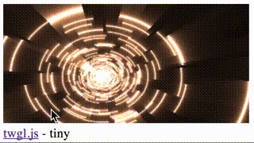

# 🛠 GLES.js examples

### Basic webGL examples
* [helloworld](./helloworld/index.html) (shaderToy example)
* twgl.js (spinning textured cube)
* [pixi.js](./pixi/index.html) (bouncing sprites)
* three.js (spinning cube)

### WebVR examples
* stereo panorama (twgl.js, split screen and sensor API)
* ARToolkit - cube
  * marker tracking
  * throughscreen camera
  * piped through webVR camera API

# ⚙ Setup
* download and install the APK
* open your phone browser
* click on the example links above

# 💬 Feedback
[add issues](https://github.com/wallabyway/glesjs)

# 🛠 References
* [webVR spec](https://webvr.info/)
* [ARToolkit](http://artoolkit.org/documentation/doku.php?id=7_Examples:example_simplelite)

# 📱Downloads
* [glesjs.apk](www/glesz.apk)
