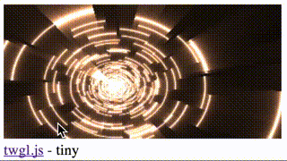

# 🛠 helloworld example

### demostrates...
* tiny footprint
* mouse movement
* simple shaderToy example
* small webgl library (twgl.js)

# 🛠 References
* [twgl.js library](http://twgljs.org)
* [gles.js library](https://github.com/borisvanschooten/glesjs)
* [glsl shader sandbox](http://glslsandbox.com/e#28331.0)
